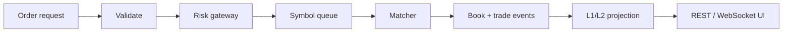
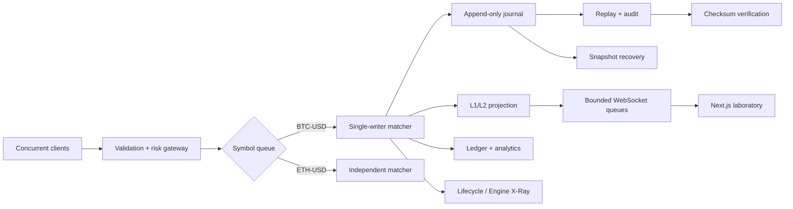

# Limit X

Limit X is a small exchange simulator I built to understand what happens between an incoming
order and a completed trade. The matching engine is written in Python; the browser is a Next.js
laboratory for watching the engine work. Nothing here connects to a broker or moves real money.

The interesting part is not a pretend trading screen. It is the trail of state behind it: integer
prices, FIFO order queues, sequenced events, replay, risk decisions, market-data gaps, and tests
that challenge the matcher from more than one direction.

## Run it locally

```bash
make install
make run-backend   # terminal 1
make run-frontend  # terminal 2
```

Open `http://localhost:3000`. Seed `42` starts a populated synthetic market, so the ladder and
trade tape have something to show immediately. **Run scenario** resets the selected regime. Docker
Compose starts the same two services if you prefer containers.

## Production

The current deployment is split in two, just like the local setup:

| Part | URL |
|---|---|
| Next.js / OpenNext Worker | [limitx.dumpydon.workers.dev](https://limitx.dumpydon.workers.dev) |
| FastAPI engine | [limitx-8hns.onrender.com](https://limitx-8hns.onrender.com) |

The Render setup is documented in [docs/render-deployment.md](docs/render-deployment.md). Local
development still falls back to `http://localhost:8000`; production builds receive the Render URL
through `NEXT_PUBLIC_API_URL`.

## How one order moves



The browser never owns exchange state. It asks the API for commands and consumes projections of
the book. If a market-data delta is missing, the client stops applying updates and requests a new
snapshot instead of guessing.

## What is in the box

| Area | Implementation |
|---|---|
| Matching | Ordered price levels, resting-price execution, price-time priority, partial fills, cancellation, and priority-aware modification. |
| Order storage | `SortedDict` for prices, intrusive doubly linked FIFO queues per level, and a direct order-ID-to-node map. |
| Policies | Limit and market orders with GTC, IOC, FOK, post-only, and cancel-taker self-trade prevention. |
| Safety | Integer tick prices, deterministic risk limits, invariant checks, snapshots, and SHA-256 state checksums. |
| History | Append-only JSONL commands/events, replay, audit, snapshot recovery, and lifecycle explanations with evidence IDs. |
| Market data | L1/L2 snapshots, sequence-linked deltas, recent trades, VWAP, bounded WebSocket queues, and gap recovery. |
| Simulation | Seeded maker, noise, momentum, taker, and whale agents across eleven named market regimes. |
| Browser labs | Market Lab, Failure Lab, Replay, Engine X-Ray, Risk & Surveillance, Recovery, and Performance Lab. |

## Matching rules in plain English

Prices are stored as integer ticks: `$100.25` becomes `10025` with a `0.01` tick size. The highest
bid and lowest ask get priority. At one price, the earlier accepted order is first. Trades use the
resting order's price.

FOK is checked before the book is changed: if the complete quantity cannot be filled from eligible
FIFO liquidity, nothing happens. IOC and market orders cancel whatever remains. Post-only rejects
if it would immediately take liquidity. A same-price quantity reduction keeps an order's place;
a price change or quantity increase gives it a new place.

## Architecture



Each symbol has one mutation worker. Different symbols can progress independently, but one book
still has one clear writer. That keeps pointer-heavy queue updates deterministic and makes replay
mean the same thing as live processing. The pure engine package imports no FastAPI, browser, or
WebSocket code; see [architecture](docs/architecture.md) and [data structures](docs/data-structures.md).

## Correctness before speed

`OrderBook.assert_invariants()` checks queue topology, aggregates, lifecycle conservation, FIFO
order, uncrossed prices, positive trades, index identity, and sequence monotonicity. The suite also
has focused unit tests, Hypothesis-generated command sequences, an independent list-based reference
matcher, replay/event comparisons, snapshot tamper checks, API tests, and simulation tests.

```bash
make lint
make typecheck
make test
make frontend-check
```

## Measurements

The benchmark times direct `OrderBook.process` calls, not HTTP or React rendering. These are local
CPython observations on an Apple M2, not production HFT promises.

| Workload | Operations | Throughput | p50 | p95 | p99 |
|---|---:|---:|---:|---:|---:|
| Mixed | 10,000 | 181,623 ops/s | 4.167 μs | 14.333 μs | 23.292 μs |
| Mixed | 100,000 | 173,825 ops/s | 4.209 μs | 14.291 μs | 22.959 μs |
| Cancel storm | 100,000 | 346,027 ops/s | 1.125 μs | 5.708 μs | 14.875 μs |
| Mixed, four symbols | 100,000 | 168,825 ops/s | 4.292 μs | 14.375 μs | 21.584 μs |

The one-million-operation run is intentionally reported as a memory stress case: it retained the
complete event/trade history and reached roughly 1.28 GB maximum RSS. See [benchmark methodology](docs/benchmarks.md).

## Replay, API, and project map

Replay consumes canonical JSONL commands, rebuilds fresh books, compares emitted events, checks
invariants, and compares final checksums. The audit CLI and export script are useful when a run
needs to be inspected outside the browser.

```bash
python -m limitx.audit data/session.jsonl
python scripts/export_demo.py
```

FastAPI exposes health, symbols, depth, trades, order submit/cancel/modify, simulation controls,
lifecycle evidence, Engine X-Ray, risk, recovery, experiments, benchmarks, exports, the read-only
Replay Analyst, and `/ws/market/{symbol}`. The analyst is deterministic and evidence-grounded; it
does not need `OPENAI_API_KEY`, place orders, or change engine state.

```text
backend/limitx/domain/       orders, commands, enums, instruments
backend/limitx/engine/       matcher, price levels, queues, events, workers
backend/limitx/risk/         pre-trade limits
backend/limitx/market_data/  snapshots, deltas, checksums, broker
backend/limitx/replay/       journal, snapshots, replay, audit
backend/limitx/simulation/   seeded agents and regimes
backend/limitx/analytics/    metrics, ledger, surveillance, exports
backend/limitx/reference/    slower differential oracle
frontend/                    TypeScript Next.js laboratory
docs/                        design notes and interview material
```

Python is a conscious trade-off here. It makes the rules and experiments easy to read and test,
while carrying interpreter, allocation, GIL, and garbage-collection costs that would not fit a
latency-critical production matcher. A future production hot path could move to Rust or C++ while
keeping Python for orchestration, simulation, analytics, and the reference implementation.

Further reading: [matching semantics](docs/matching-semantics.md), [testing](docs/testing.md),
[market data](docs/market-data.md), [AI grounding](docs/ai-grounding.md), and the
[interview guide](docs/interview-guide.md).
