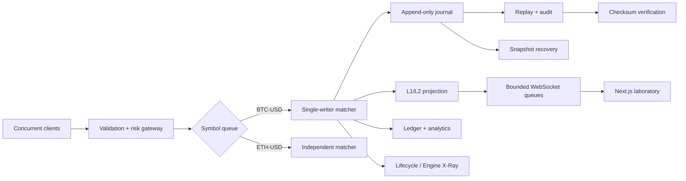

# Limit X

Deterministic exchange matching-engine and market-microstructure laboratory implemented in
Python. Limit X models price-time-priority execution, advanced time-in-force semantics,
deterministic event replay, risk controls, seeded market regimes, microstructure analytics, and
measured core-engine performance.

The project intentionally prioritizes correctness and inspectability over claims of production
HFT latency. It is a simulated venue: it has no broker integration and never routes real orders.

The terminal makes the engine observable: realistic deterministic instrument fixtures, live L2
depth, execution tape, exact order reports, event-backed lifecycle explanations, Engine X-Ray,
snapshot recovery, replay, transport failure injection, risk/surveillance consoles, and measured
performance history all come from backend state—not frontend-only animation.

## Demo

```bash
make install
make run-backend   # terminal 1
make run-frontend  # terminal 2
```

Open `http://localhost:3000`; the default seed `42` automatically starts a populated simulated
market with a live ladder, cumulative depth, execution tape, analytics, and replayable journal.
**Run scenario** restarts from the selected seed/regime.
`docker compose up --build` provides the same backend/frontend pair.

## Production deployment

The FastAPI backend is prepared for a Render Free Web Service and the Next.js frontend is prepared
for the Cloudflare Workers OpenNext adapter. Use [Render deployment](docs/render-deployment.md) for
the exact dashboard settings. The Render URL must be supplied as `NEXT_PUBLIC_API_URL` when the
`limitx` Worker is deployed; it is intentionally not hard-coded because Render assigns the service
hostname.

## Engineering highlights

- Integer-tick matching with resting-price execution and strict price-time priority.
- Explicit price levels containing intrusive doubly linked FIFO queues; a hash map points order
  IDs directly to live nodes for O(1) lookup and O(1) unlink after lookup.
- Limit, market, GTC, IOC, atomic FOK, post-only, partial fill, cancel, priority-aware modify, and
  cancel-taker self-trade prevention semantics.
- A single-writer command task per symbol, append-only command/event journal, state snapshots,
  stable JSON, deterministic replay, and SHA-256 state checksums.
- Separate risk gateway, L1/L2 projection, sequence-linked deltas, bounded WebSocket subscriber
  queues, and snapshot recovery after a delta gap.
- Seeded noise, market-making, momentum, taker, and whale agents across eleven market regimes,
  including a synthetic cancel storm.
- Explicit invariant checks, deterministic edge-case tests, Hypothesis property tests, and
  thousands of randomized differential operations against a separate list-based oracle.
- Microstructure analytics, an exact tick-based account ledger, explainable surveillance
  heuristics, exportable artifacts, and a read-only evidence-grounded Replay Analyst.
- A journal-backed order lifecycle inspector and multi-level match visualizer explain partial
  fills, IOC remainder cancellation, atomic FOK rejection, post-only rejection, risk decisions,
  priority-aware modification, and cancellation with concrete event IDs.
- Engine X-Ray renders the real selected `PriceLevel`, linked FIFO nodes, price index, and direct
  order-index pointers; the recovery lab reconstructs a captured snapshot with subsequent journal
  commands and compares expected versus recovered checksums.
- Performance Lab 2.0 supports custom add/cancel/modify mixes, one to four symbols, latency
  histograms, active-state/memory facts, and local run comparisons without significance claims.
- The custom Limit X mark reacts only to real engine outcomes: restrained buy/sell acceptance,
  trade convergence, multi-level sweep, rejection, and market-data resynchronization states are
  coalesced to keep high-volume sessions smooth and become static accents under reduced motion.
- A cinematic closing wordmark renders `Limit X` entirely from a sampled matrix of tiny square
  canvas cells. Slow organic buy/sell energy fields travel only inside the glyph mask, react to
  real market events, pause offscreen, scale for high-DPI displays, and remain static under reduced
  motion.

## Architecture



The pure package under `backend/limitx/engine` imports no FastAPI, browser, or WebSocket code.
See [architecture](docs/architecture.md), [matching semantics](docs/matching-semantics.md), and
[data structures](docs/data-structures.md).

## Matching semantics

Prices are integer ticks (`$100.25 → 10025`) and quantities are integers. Best price wins; an
order's `accepted_sequence` breaks ties at a price. Trades execute at the resting order's price.
FOK walks eligible FIFO liquidity before accepting and therefore never partially mutates the
book. A same-price quantity decrease retains priority; a price change or quantity increase loses
it. Post-only rejects rather than taking. Market and IOC remainders cancel.

## Correctness strategy

`OrderBook.assert_invariants()` checks topology, aggregates, lifecycle conservation, index
identity, FIFO order, uncrossed state, positive trades, and sequence monotonicity. The test suite
adds an independently structured `ReferenceBook`, replay event equivalence, snapshot tamper
detection, API tests, and Hypothesis-generated command sequences.

```bash
make lint
make typecheck
make test
make frontend-check
```

## Measured benchmarks

Core-only measurements taken on this machine (Apple M2, 8 GB RAM, macOS 15.7.8, CPython 3.14.3)
after tests and replay checks passed:

| Workload | Operations | Symbols | Runs | Throughput | p50 | p95 | p99 |
|---|---:|---:|---:|---:|---:|---:|---:|
| Mixed | 10,000 | 1 | 3 | 181,623 ops/s | 4.167 μs | 14.333 μs | 23.292 μs |
| Mixed | 100,000 | 1 | 3 | 173,825 ops/s | 4.209 μs | 14.291 μs | 22.959 μs |
| Cancel storm | 100,000 | 1 | 3 | 346,027 ops/s | 1.125 μs | 5.708 μs | 14.875 μs |
| Mixed | 100,000 | 4 | 3 | 168,825 ops/s | 4.292 μs | 14.375 μs | 21.584 μs |
| Mixed memory stress | 1,000,000 | 1 | 1 | 96,950 ops/s | 5.709 μs | 20.042 μs | 28.250 μs |

These are second-pass local CPython observations, not production guarantees. The one-million
operation run retained the complete event/trade history, reached roughly 1.28 GB maximum RSS, and
exhibited a 1.110 s maximum outlier—making memory growth, runtime, GC, and scheduler noise
visible rather than hiding them. See [benchmark methodology](docs/benchmarks.md).

Profiling caught an accidental FOK-liquidity preflight on every order. At that optimization
checkpoint, limiting the walk to FOK orders on the identical 100K mixed workload (seed 42, three
runs) improved observed throughput from 141,824 to 180,506 ops/s (+27.3%) and reduced pooled p99 from 26.375 to
20.916 μs (-20.7%). This is a local before/after observation, not a generalized guarantee.

```bash
python -m limitx.bench --scenario mixed --orders 100000 --seed 42 --runs 3
```

## Replay and audit

Commands and their resulting structured events are serialized as canonical JSONL. Replay
re-runs commands through fresh per-symbol books, compares event output, checks invariants, and
compares final checksums.

```bash
python -m limitx.audit data/session.jsonl
python scripts/export_demo.py  # events.jsonl, session.jsonl, trades/depth/metrics CSV
```

## API

FastAPI exposes health, symbols, book/depth, trades, order submit/cancel/modify, live orders,
simulation controls, lifecycle evidence, Engine X-Ray, risk configuration, surveillance,
snapshot recovery, regime comparison, metrics, system state, replay, benchmarks/history,
exports, analyst, and
`/ws/market/{symbol}`. OpenAPI is available at `http://localhost:8000/docs`.

## Project map

```text
backend/limitx/
  domain/       explicit orders, commands, enums and value types
  engine/       matcher, FIFO levels, sorted index, events, symbol workers
  risk/         deterministic pre-trade limits
  market_data/  L1/L2 snapshot, deltas, checksum, bounded broker
  replay/       JSONL journal, snapshots, replay and audit CLI
  simulation/   seeded agents and market regimes
  analytics/    metrics, ledger, surveillance and exports
  reference/    slower list-based differential oracle
  benchmarks/   direct core-engine workloads and percentile reports
  ai/           read-only rule-based grounded analyst
  api/          FastAPI adapter
frontend/       strict TypeScript Next.js laboratory UI
docs/           decisions, semantics, testing, replay and interview guide
```

## Scope and trade-offs

Python makes the semantics inspectable and the correctness tooling unusually strong. It also
brings interpreter overhead, allocation cost, the GIL, GC pauses, and unsuitable tail behavior
for a latency-critical native matcher. A plausible production evolution keeps Python for
the gateway, simulation, analytics, and reference behavior while moving the equivalent hot path
to Rust or C++. Limit X deliberately does not claim that migration has happened.

Further reading: [trade-offs](docs/tradeoffs.md), [testing](docs/testing.md),
[market data](docs/market-data.md), [AI grounding](docs/ai-grounding.md), and the
[interview guide](docs/interview-guide.md). For a recruiter/interview walkthrough and keyboard
map, see the [product guide](docs/product-guide.md).
