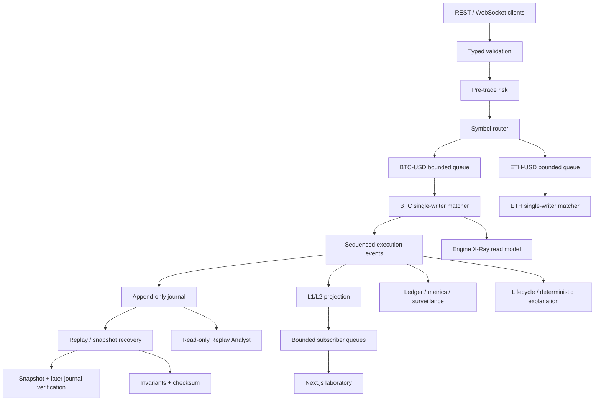

# Architecture

Limit X is a modular monolith with explicit concurrency boundaries. Sophistication comes from
ownership and invariants, not from deploying unnecessary infrastructure.

## Ownership and concurrency

Concurrent producers never mutate a book. `SymbolWorker` owns a bounded `asyncio.Queue` and one
task invokes its handler serially. BTC-USD and ETH-USD use independent queues/tasks, so unrelated
symbols can progress concurrently without a global book lock. Inside a symbol, the book,
sequencer, price levels, and live-order index belong to one writer.

This gives deterministic arrival order, avoids lock races in pointer-heavy structures, and makes
replay behavior match live behavior. A production service might shard symbol workers across
processes; it would retain one writer per shard/book.

## Boundaries

- **Gateway:** Pydantic shape validation and security limits.
- **Risk:** configurable quantity, notional, live-order, position, exposure, collar, and symbol
  checks. It does not select prices or matches.
- **Matcher:** pure Python state machine. No I/O or wall-clock decisions.
- **Journal:** records canonical commands and their event results. It is not queried by matching.
- **Projection:** converts private L3 state into L1/L2 snapshots and linked deltas.
- **Broker:** bounded per-client queues. A full queue is cleared and replaced with a snapshot.
- **Analytics:** observes events; it never changes priority or execution.
- **Lifecycle explanation:** joins canonical commands and events for a selected order. Accepted,
  trade, modify, cancel, and rejection stages cite actual `event:N` or `command:N` evidence.
- **Engine X-Ray:** reads the current `PriceIndex`, selected `PriceLevel`, linked nodes, and live
  order index. It owns no duplicate state and never mutates the book.
- **Recovery:** captures L3 live state, seen order IDs, sequence, checksum, journal position, and
  risk positions; later verification rebuilds from that snapshot and replays subsequent commands.
- **Replay Analyst:** read-only deterministic summaries with validated evidence IDs.

The API runs long replay jumps, regime experiments, and benchmarks in worker threads so CPU-heavy
inspection cannot block the asyncio/WebSocket event loop. Bulk replay neither scans all invariants
nor serializes a full L3 snapshot after every historical command; both happen once at the selected
boundary. On a 5,024-command local session this changed the replay endpoint observation from
5.19 seconds to 99 ms after the final snapshot-boundary fix.

## Product observability surfaces

The Next.js client is a projection and control surface, never an execution source of truth:

- **Market Lab:** sequence-linked L2, cumulative depth, actual trades, exact order reports.
- **Failure Lab:** deliberately drops, delays, duplicates, or reorders client delivery; the
  sequence guard stops application and retrieves a fresh snapshot.
- **Replay:** reconstructs a selected command position and filters real event evidence.
- **Engine X-Ray:** exposes current data structures, owned state, invariants, and recovery.
- **Risk & Surveillance:** configures bounded demo risk limits and shows deterministic rules,
  observed values, thresholds, alerts, regime experiments, and grounded analysis.
- **Performance Lab:** direct core workloads with histograms, history, memory, and environment.

SQLite, Kafka, Redis, and a service mesh would add operational failure modes without improving
this laboratory's core claim, so they are intentionally absent.
