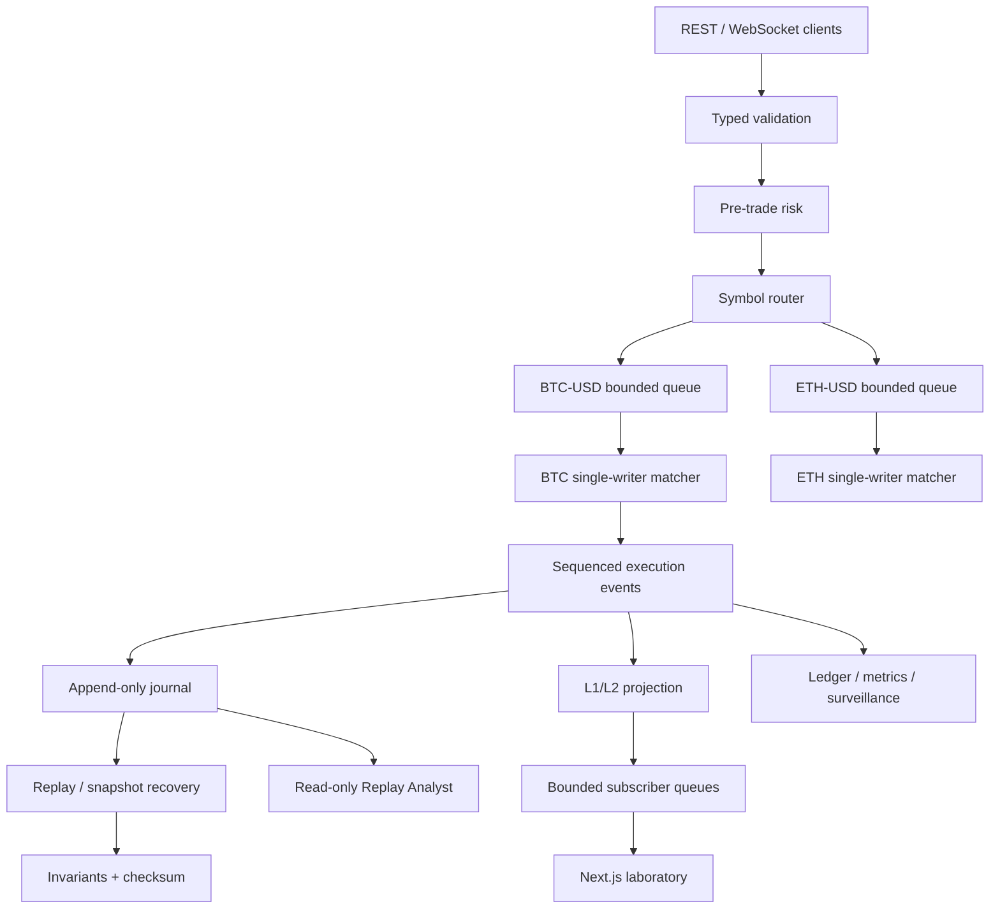

# Architecture

Limit X is a modular monolith with explicit concurrency boundaries. Sophistication comes from
ownership and invariants, not from deploying unnecessary infrastructure.

## Ownership and concurrency

Concurrent producers never mutate a book. `SymbolWorker` owns a bounded `asyncio.Queue` and one
task invokes its handler serially. BTC-USD and ETH-USD use independent queues/tasks, so unrelated
symbols can progress concurrently without a global book lock. Inside a symbol, the book,
sequencer, price levels, and live-order index belong to one writer.

This gives deterministic arrival order, avoids lock races in pointer-heavy structures, and makes
replay behavior match live behavior. A production service might shard symbol workers across
processes; it would retain one writer per shard/book.

## Boundaries

- **Gateway:** Pydantic shape validation and security limits.
- **Risk:** configurable quantity, notional, live-order, position, exposure, collar, and symbol
  checks. It does not select prices or matches.
- **Matcher:** pure Python state machine. No I/O or wall-clock decisions.
- **Journal:** records canonical commands and their event results. It is not queried by matching.
- **Projection:** converts private L3 state into L1/L2 snapshots and linked deltas.
- **Broker:** bounded per-client queues. A full queue is cleared and replaced with a snapshot.
- **Analytics:** observes events; it never changes priority or execution.
- **Replay Analyst:** read-only deterministic summaries with validated evidence IDs.

SQLite, Kafka, Redis, and a service mesh would add operational failure modes without improving
this laboratory's core claim, so they are intentionally absent.

