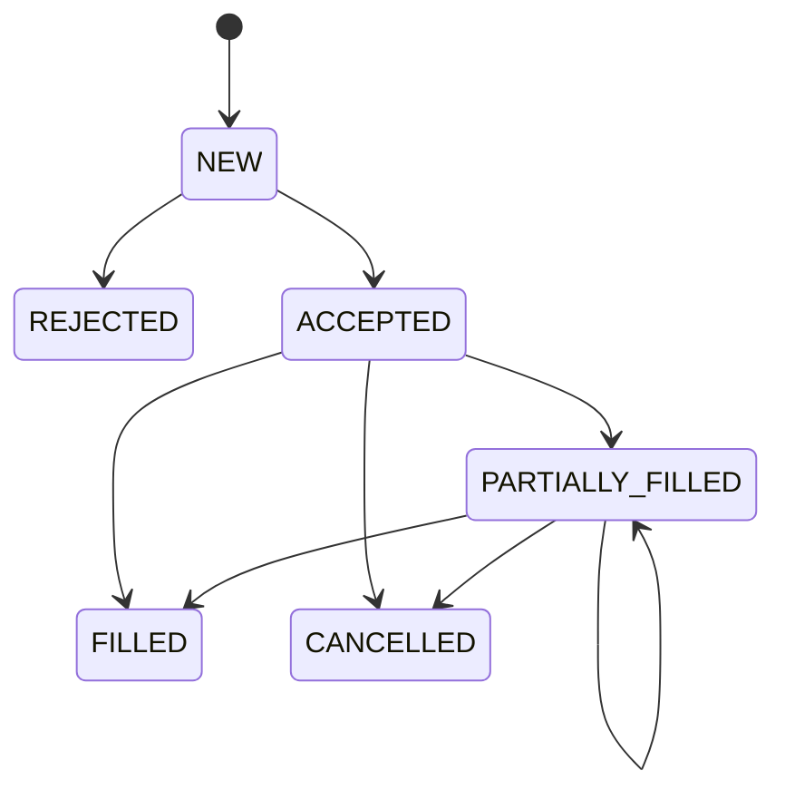

# Matching semantics

## Numerics and priority

Prices are positive integer ticks and quantities are positive integers. The matcher never uses a
binary float to decide a cross. Bids prefer the highest price, asks prefer the lowest, and each
level executes from linked-list head to tail. Execution uses the resting maker's price.

## Orders and time in force

- **Limit / GTC:** consume eligible better/equal levels, then rest the remainder.
- **Market / IOC:** consume available opposing liquidity without a synthetic price; cancel the
  remainder.
- **IOC limit:** trade immediately within its limit and cancel any remainder.
- **FOK:** preflight the exact eligible FIFO path, including cancel-taker STP. Insufficient
  liquidity produces `FOK_NOT_FILLABLE` before acceptance or mutation.
- **Post-only:** reject with `POST_ONLY_WOULD_TRADE` if it would take; otherwise rest.

Self-trade prevention defaults to `CANCEL_TAKER`. Encountering the same account at the head of an
eligible FIFO path cancels the incoming remainder and does not skip past its own liquidity.

## Modify policy

`new_quantity` is the new total original quantity and must exceed already-filled quantity.

| Change | Priority |
|---|---|
| Same price, quantity decrease | Retained |
| Price change | Lost |
| Quantity increase | Lost |

A priority-losing replacement is unlinked, receives the modification event's sequence as its new
priority, and can trade at its new price. A crossing post-only replacement is rejected without
changing the original order.

## State transitions

Every fill preserves `filled_qty + remaining_qty == quantity`. Rejected, cancelled, and filled
orders cannot remain in the live-node index.

